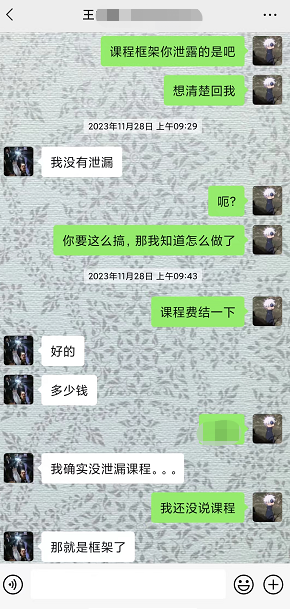
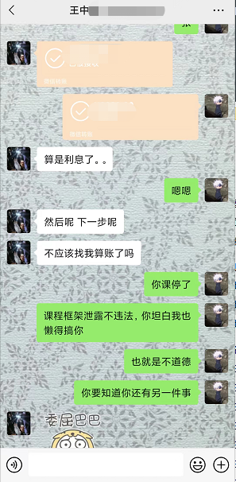
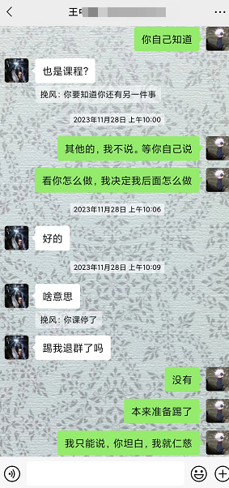
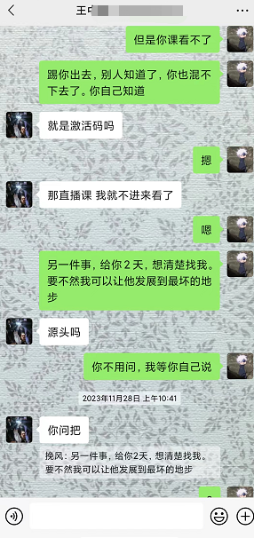
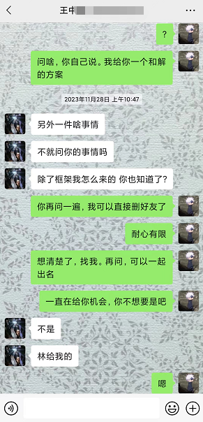
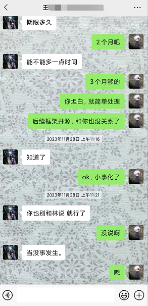

# 前言

这里不讲框架, 介绍看食用手册.md.

# 为啥开源这个框架?

## 起因

去年的时候, 心血来潮. 我决定和不不开一个补环境框架设计的课. 内容是关于修改node源码+js框架相结合的补环境框架(主要是优化+过一些棘手的检测点)

讲课之前, 我基于上一版自己写的框架基础上, 重构优化了一遍, 才有了现在开源的这版.

## 经过

抱着试试水的态度, 我简单在群里宣传了一下. 

### 事件1

接下来, 圈内“红”人 “王某某” 找到了我. 他说没钱, 买课能不能分期付款. 我说有钱了一次性给就好了, 就没催过他给钱(没催就没给).

真心想学习的人, 我不会拒之门外 (之前的心态)

结果我发现这人是真不学啊, 后面框架代码发到网盘后, 马上就被他泄露出去了. 

借用小刚的一句歌词来表达当时的心情, “怎么会温柔体贴 换来绝望的体验 无语也无言”

但毕竟课程代码发到网盘里, 泄露只是迟早的事, 是没法控制的. (我这样安慰自己)

- **补充**：
	name: 王某某
    
    网名: 一招半式、走江湖
    
    这个人一开始拿着px3代码(没”红“之前)问我要不要, 美名其曰”交个朋友“, 我没要, 就没怎么跟这个人打交道了

### 事件2

前面说到开源的框架是基于上一版自己写的框架重构的. 这个框架我是放在github的私人仓库里.

当时身边有这么一个人, 他技术不咋好, 蛮想学技术的. (偶尔聊聊认识也快一年了, 感觉人品还行吧) 脑子一热, 我拉他成为项目的Collaborator. 

我让他先看看代码, 晚些时候又给他开了个会议, 简单讲了框架的设计思路、原理啥的, 然后让他有不懂的在问... 他确实也在试着写, 效果不是很好就是了

再后来, 我发现我私人仓库的代码被“王某某”泄露了. 

(当时真的是被这个人的手眼通天惊讶到了, 放在私人仓库的代码都能被他拿到, 歪日)

**后面也找到了泄露的人, 他拿着框架跟“王某某”换了其他的成品.** 

代码一旦流通到“王某某”手里, 那跟开源就没区别了. 他拿着这些代码, 去交换自己的人情. 利用人情再得到其他大佬手里的代码, 可以说玩的一手好“操作”.

- **补充**：
    name: 陈某某
	
    网名: 林

## 结果

关于这两件事, 我也给出了和解条件: 经济赔偿. 这样我也挽回了损失, 他还可以继续他的骚“操作” 

一番交涉下来, ”王某某“的认错态度还行, 主动承认了这些事

我提出建议, 让”王某某“和”陈某某“一起平摊经济赔偿. ”王某某“说”一人做事一人担“, 不用找”陈某某“ (他看起来很有担当的样子, 差点连我都要感动了)

于是我给了他3个月时间让他凑钱. 没想到初步的同意竟只是”缓兵之计“, 后续再找他的时候, 等来的就只有各种已读不回了. 

ps: 就这种烂人, 还有人和他一块“同流合污”

接下来, 我只好跟”陈某某“进行交涉了. 他一开始的态度还行, 也愿意进行经济赔偿. 

直到我提出让他去银行贷款分期, 就百般不愿意了. 利率我可以接受平摊, 但不可能要我每个月去收钱的. 欸, 说到底也是没想赔偿的

再后来也不知道“王某某”给他灌了什么迷魂汤, 直接装死不回我了, 接着他就开始删好友退群.

退圈就想了事? **这tm不是欺负老实人嘛?!**

既然闹到这一步, 那就都别混咯

## 贴几个图

## 结语

**若要人不知, 除非己莫为**